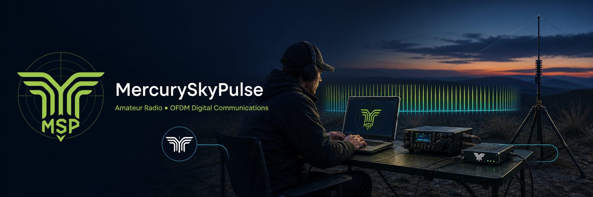

# Mercury SkyPulse



[](LICENSE)


Mercury SkyPulse is a cross-platform, local-first station application built around
the independent [Mercury](https://github.com/Rhizomatica/mercury) HF modem
transport engine.

The user-facing product name includes the space shown above. Stable technical
identifiers retain `MercurySkyPulse` in repository URLs, executable and bundle
filenames, Python packages, and existing application-data paths so upgrades do
not break installations or saved configuration.

Mercury runs as its own process-isolated transport engine; Mercury SkyPulse
communicates with it through documented interfaces. A small public
[MSP compatibility fork](https://github.com/N4EAC/mercury) carries N4EAC's
Mercury integration work while preserving this boundary:

- conservative, non-blocking Hamlib frequency telemetry with CAT-duration
  diagnostics and post-PTT quiet time;
- independent read-only ARQ TX and peer RX DATAC-mode telemetry;
- correction of local PTT-active state when a Hamlib PTT command fails; and
- use of Mercury's configured archiver in the FreeDV build, accepted upstream
  by Rhizomatica in [PR #206](https://github.com/Rhizomatica/mercury/pull/206).

The telemetry and PTT work remains in the MSP compatibility fork while upstream
review continues. Packaged MSP builds pin the combined Mercury 1.9.12 revision
`84d35fbc`; the package records its complete source revision and licenses.

MSP uses Mercury's documented interfaces:

- VARA-style ARQ TNC control TCP port (default `8300`);
- ARQ data TCP port (default `8301`);
- KISS broadcast TCP port (default `8100`) for capability beacons; and
- WebSocket status/spectrum endpoint and documented bounded controls (default
  `/websocket` on port `10000`).

## Status

The repository contains a feature-complete vertical-slice prototype with a
PySide6 desktop application and optional supervised Mercury child process. It
includes dockable operator UI, modem telemetry, ARQ chat and file transfer,
location and GPS workflows, capability beacons, station ping, a persistent BBS,
a loopback-only read-only web interface, optional PSK Reporter reception uploads,
a trusted built-in plugin kernel, and no product activation or feature editions. It is suitable for continued development and controlled
manual testing, but is not yet a production release.

Mercury remains a process-isolated engine accessed through its documented UI
WebSocket and TNC TCP interfaces. Packaged MSP builds include a pinned,
MSP-compatible Mercury fork runtime so operators do not install or copy it
separately.

Recent connection reliability work adds a 60-second unanswered-call timeout and
peer-confirmed session startup. Mercury's local `CONNECTED` notification is
provisional until the remote MSP acknowledges a bounded application probe; an
asymmetric or false connection is cancelled before chat, file, BBS, or
other session traffic is enabled.

MSP also translates known fatal Mercury startup failures into actionable ARQ
status. An unavailable configured Hamlib radio directs the operator to correct
or disable it under **Setup → Radio**; an unavailable modem audio path directs
the operator to **Setup → Audio**. Complete Mercury diagnostics remain available
in Activity and the persistent log.

### Platform support

| Platform | Current status |
|---|---|
| Windows 10/11 x86-64 | Supported for engineering builds and live-radio testing through `build.exe.bat` |
| macOS Apple Silicon | Supported for engineering builds and live-radio testing through `build.app.sh` |
| Fedora 42 Linux x86-64 | Alpha RPM built, installed, and launched successfully; further radio/hardware validation remains |
| Ubuntu Linux x86-64 | Alpha DEB built and installed successfully; further radio/hardware validation remains |

Fedora 42 RPM packaging, installation, desktop registration, and application
launch have been validated. Further Fedora audio, CAT/PTT, GPS, and RF testing is
still required. Ubuntu package creation and installation have been validated;
audio, CAT/PTT, GPS, and RF testing remain. Intel macOS is not part of the
presently validated build matrix.

### Alpha downloads

[Mercury SkyPulse 0.1.0 Alpha 2](https://github.com/N4EAC/MercurySkyPulse/releases/tag/v0.1.0-alpha.2)
provides Apple Silicon macOS, Windows 10/11 x86-64, Fedora 42 x86-64, and Ubuntu
x86-64 engineering installers with SHA-256 checksums.

[Mercury SkyPulse 0.1.0 Alpha 1](https://github.com/N4EAC/MercurySkyPulse/releases/tag/v0.1.0-alpha.1)
remains available with the earlier unsigned engineering installers for:

- Apple Silicon macOS (`.dmg`, drag to Applications);
- Windows 10/11 x86-64 (Inno Setup `.exe`); and
- Fedora 42 x86-64 (`.rpm`).

All alpha artifacts are intended for controlled testing rather than production use.
Active development after Alpha 2 identifies itself as **0.1.7 — Capella**.

Capella preserves Vega's efficient text communication over constrained half-duplex
RF. Peer confirmation uses three compact 14-byte, versioned control frames:
probe, acknowledgement, and readiness. This preserves bilateral confirmation
without the earlier 144–198-byte JSON handshake frames. Voice chat, typing and
recording presence traffic, separate voice audio settings, and PyAV/Opus are
removed, so no optional voice negotiation can enter Mercury's queue ahead of
operator text. Activity and persistent logs identify each validation stage. The
privacy-neutral failure and correction record is maintained in
`docs/FAILURES_AND_CORRECTIONS.md`.

Capella also bounds each station to one unacknowledged outbound text message.
Operators may continue composing; later messages remain visibly queued and are
admitted only after peer-confirmed delivery and a drained local Mercury buffer.
This adds no routine RF control traffic and leaves Mercury's native ISS/IRS,
`HAS_DATA`, and `TURN_REQ`/`TURN_ACK` mechanisms authoritative.

If a locally drained peer-validation frame is lost, Capella makes at most two
bounded retries using the same compact session token. Caller and listener retry
windows are staggered so recovery does not create a simultaneous half-duplex
transmission. Successful connections retain the normal three-frame exchange,
and answering a CQ removes that invitation from the caller list immediately.

Capella extends the self-contained offline operator speech
engine by announcing **Mercury Sky Pulse** locally at startup. macOS and Windows
packages include pinned eSpeak NG 1.52.0; Linux packages bundle the compatible
distribution runtime after validating both required voice variants.
The Linux builder also detects older Hamlib releases without `rigerror2` and
uses the compatible diagnostic function without disabling CAT/PTT support.
It uses no cloud or operating-system speech service, no prerecorded voice asset,
and no Mercury/RF audio path. Connected-station announcements expand callsigns
with ITU/NATO phonetic words and spoken digits, for example **N4EAC** becomes
**November four Echo Alpha Charlie**. The Setup window can disable all local
announcements or select the packaged male or female eSpeak voice. Received
beacons and CQ calls announce the sending callsign without generating RF traffic.

### Station chat

The central Chat workspace provides station-to-station text conversations. On the receiving
station, enter a callsign and choose **Listen**. On the initiating station, enter
both callsigns and choose **Connect**. Messages include timestamps and queued,
sent, delivered, or failed status. Delivered means the peer application returned
an acknowledgement; it is not a read receipt.
The connection controls follow the validated application state: Connect, Listen,
Call CQ, and Answer CQ are unavailable during a call attempt or active session,
while Disconnect remains available from calling through peer validation and the
connected session. A prominent **CONNECTED TO CALLSIGN** banner remains visible
for the full validated session, and the offline speech engine announces the
connected station with ITU/NATO phonetic words and spoken digits.
Only one outbound text message is admitted to Mercury at a time. Additional text
is retained locally as queued rather than inflating Mercury's half-duplex buffer.

Chat renders outgoing file lifecycle snapshots as **queued**, **sent**,
**delivered**, or **failed**. Sent requires receiver participation; delivered
requires the receiving application's final checksum result. A delivered outgoing
file clears the send controls and progress bar for the next transfer.
An operator can cancel any offered, active, paused, or verifying file transfer.
Loss of the ARQ session marks unfinished transfers interrupted, deletes incomplete
received data, releases the transfer queue, and requires a fresh send after
reconnection rather than attempting an unsafe cross-session resume.
Conversation history is stored locally in the platform application-data directory.
Direct station calls stop automatically after 60 seconds when unanswered. A
Mercury `CONNECTED` indication is shown as provisional until the remote MSP
acknowledges a bounded session probe; an unconfirmed link is cancelled rather
than enabling application traffic on only one station.
The same connected station can receive files through **Send File…**. Transfers
may be paused or resumed. Every new incoming file requires operator acceptance.
Received content is stored under the
platform Downloads directory in `Mercury SkyPulse`, after SHA-256 verification.
Previously received identical content is detected by checksum and not written a
second time. **Open Folder** reveals completed content. Outgoing progress remains
indeterminate while bytes are queued through Mercury and reaches 100% only after
the peer reports a verified checksum result. The initial file-size limit is 100 MiB.

Supported images are prepared automatically before transfer: orientation is
corrected, the longest edge is resized to at most 1920 pixels, opaque images are
optimized as JPEG, transparency is preserved with compressed PNG, and a compact
thumbnail is shown in the transfer UI. Source images are never modified.

### Position and GPS

The Setup window's GPS tab accepts manual decimal latitude/longitude or APRS-compatible
`DDMM.mmN/DDDMM.mmE` coordinates. It can use the operating system location source
or a serial NMEA GPS receiver at 4800 baud. Available serial/COM ports are listed
in an editable selector, so an unlisted port can still be entered manually.
Missing, non-finite, or negative receiver accuracy is treated as unknown without
discarding an otherwise valid coordinate fix. Manual position is retained locally;
GPS fixes are not stored as history.

After the operator starts GPS, MSP remembers that choice and automatically starts
the saved serial or system location source on later launches. If that source is
not present, GPS remains unavailable and reports the condition without selecting
or opening an unrelated COM port. Choosing **Stop GPS** disables automatic start.

**Share Location** sends the current validated position to the connected station.
Location is never transmitted automatically. Received locations are range-checked
and their APRS and decimal representations must agree before display. This is
coordinate compatibility only; Mercury SkyPulse does not transmit APRS packets or
connect to APRS-IS.

GPS track retention is disabled by default. Enable **Retain GPS location updates**
to store subsequent fixes with timestamps and optional accuracy. The GPS setup tab
shows the retained point count and exports the track as GPX, Google Earth KML,
GeoJSON, or latitude/longitude CSV. Disabling retention stops new points but keeps
existing history available for later export.

### Station beacon

The dockable Beacon panel advertises the station callsign, Maidenhead grid,
software version and supported data capabilities over
Mercury's connectionless KISS broadcast port.
Beaconing
is Off by default and supports 1, 5, 10, 15, 30, or 60-minute intervals plus a
manual **Send Now** action.
Station Status displays **Next Beacon: Manual** while periodic beaconing is off;
when an interval is enabled it displays the live time remaining until the next
scheduled transmission. The countdown text turns bright red only during the
final ten seconds.
Periodic beaconing shows **Paused** during an ARQ session and for 300 seconds
after each CQ call. It resumes with a fresh interval when no pause remains.

The Setup → Weather page can make a manual request to wttr.in after explicit
operator consent. MSP uses the current saved station coordinates, or the center
of the saved GRID according to the operator's location-source preference; it
never requests weather by IP-derived location. After setup, the **WX** button
beside Chat's Send button fetches in the background and inserts the bounded report
into the message draft only while an ARQ station session is connected. It remains
editable and is never transmitted automatically. Setup can preview weather but
cannot insert it into Chat. Weather is not currently included in beacons.

MSP-generated protocol, diagnostic, reporting, Chat, BBS, and weather-fetch
timestamps are stored or displayed in UTC. Mercury-originated relative timing and
modem telemetry remain unchanged.
The bottom status bar shows the current UTC date and time through minutes.

Station Status shows a compact **GRID** card. It is calculated from the current
GPS/manual coordinates when available and otherwise uses the station GRID saved
in User Setup.

Chat's **Conversations** list is persistent local history. It shows each remote
callsign and last-contact time in UTC. Operators can delete a selected conversation
and its locally stored messages after confirmation. Empty connection attempts
older than 30 days are removed automatically; conversations containing messages
are never expired automatically.
The conversation and message areas retain a draggable but visually transparent
splitter; the panel borders provide the visible separation.

Precise GPS coordinates are optional and disabled independently. When enabled,
the latest valid GPS-source fix and its timestamp are included; manual positions
are not substituted. This is a compact Mercury broadcast application beacon, not
an APRS packet or APRS-IS announcement.

### CQ discovery

Chat provides **Call CQ** without requiring an ARQ connection. MSP broadcasts a
short-lived callsign, grid, version, and timestamp invitation on the current
radio frequency. Other MSP stations display valid callers for five minutes and
can select **Answer CQ** to start the normal Mercury ARQ connection. CQ calls do
not change the radio frequency or mode and are not submitted to PSK Reporter.
Both operators must remain on the common frequency while connecting; manually
retuning during an active ARQ session can stall or terminate it.

### Station ping

The dockable Ping panel sends a bounded request to the station connected through Mercury ARQ
and reports round-trip time, local SNR, remote SNR, remote bitrate, and remote
modem mode. RTT is measured locally with a monotonic clock and includes the radio
and application path. Pings time out after 15 seconds and only one may be active.

Mercury's current telemetry does not expose its exact FreeDV modulation name, so
the mode is reported as `ARQ` or `idle` unless Mercury supplies a future `mode` or
`modem_mode` status field.

### Station setup and radio

Edit → **Setup…** opens a separate window with **Radio**, **Audio**, **User**,
**GPS**, and **Reporting** tabs. The main window remains focused on operating views. Radio configures
CAT and PTT without making Mercury SkyPulse a second
radio controller. For a managed local engine, it asks the selected Mercury
executable for its complete compiled Hamlib catalog with `mercury -K`; the list is
scrollable and searchable by manufacturer or model. Select a model, a discovered
COM/USB serial port (or manually enter a device/`ip:port`), and serial speed.
Mercury's WebSocket-reported capture and playback devices populate editable audio
selectors. When Mercury omits either list, locally discovered operating-system
audio names provide a fallback that Mercury resolves to its native device ID.
Choose **Save Station I/O and Restart Mercury** to persist the CAT and
audio device IDs in the application-owned Mercury configuration and restart the
managed modem once. Mercury remains the only process that opens audio, Hamlib,
and PTT. External Mercury profiles must be configured at their host.

While **Setup → Audio** is visible, MSP displays read-only live audio-path
diagnostics without keying the radio: selected friendly names and complete
Mercury-native endpoint IDs, inferred RX capture energy from Mercury's public
spectrum, decoded SNR, and spectrum sample rate/bin count. After five seconds it
distinguishes missing telemetry from telemetry with no energy above -100 dBFS and
suggests Windows Virtual Cable capture checks. Mercury does not currently publish
PCM channel peaks, playback level, Windows host API, or negotiated capture format;
MSP labels those limits rather than inventing values. ADR 0021 records this policy.

**TX Level Test** sends the station's normal real-call beacon every three seconds
for at most 12 seconds while allowing live modem TX-gain adjustment from -20
through 0 dB. Mercury's reported TX peak is displayed. The operator must
understand that the action transmits RF; an active ARQ link blocks or stops it.

Audio prefers capture/playback IDs reported by Mercury and falls back to editable
local device names when a Mercury list is unavailable. User stores the station
callsign and Maidenhead grid used by beaconing. GPS contains manual, system/serial
GPS, history/export, and sharing controls. Saving a valid manual position or
receiving a valid GPS position also
recalculates the proposed User-tab GRID, replacing stale placeholder text. Blank
manual coordinates produce a direct prompt to enter latitude and longitude. GRID
calculation is local and does not use an internet geolocation provider.

While Setup → Audio is visible, bounded spectrum telemetry supplies the labelled
inferred capture-energy diagnostic. MSP has no general signal-plot display.

### Reception reporting

Setup → **Reporting** provides optional, disabled-by-default PSK Reporter uploads.
When enabled, successfully decoded MSP beacons are reported with the station
callsign/GRID, antenna description, decoded station identity, Mercury's current
read-only CAT frequency, and ADIF mode `OFDM`. Mercury polls its existing Hamlib
session conservatively and suppresses polling during ARQ and transmit activity;
MSP does not open another CAT connection. Stale or unavailable frequency data
prevents a report. No message, BBS, file, credential, or precise GPS content is
uploaded.

The Reporting page includes a bounded, read-only activity log showing queued
receptions, receiver and sender fields, frequency, mode, timestamps, IPFIX packet
metadata, resolved destination, byte counts, and upload outcomes.

The main window also provides a movable, resizable **Radio Frequency** dock. It
displays Mercury's cached Hamlib reading without a changing age counter. It is deliberately read-only;
frequency and mode remain under direct operator control at the radio.

### BBS mailbox

For field-by-field setup, roles, connection steps, and security limitations, see
the [BBS usage guide](docs/BBS_GUIDE.md).

The dockable BBS panel provides persistent Inbox, Outbox, Bulletins, and Files folders.
Operators can send addressed private messages, post public bulletins, upload files
to an application-owned catalog, and request remote catalog files for verified
download. Uploads are capped at 100 MiB and retain their exact SHA-256 identity.

The Access tab can optionally protect a station BBS with a shared password.
Protection starts disabled. The station commander enables it with a callsign and
10–256 character password, then assigns `user`, `operator`, or `commander` roles
to callsigns. Users may exchange private mail and request files; operators may
also publish bulletins and files. Connect to a protected BBS first, then use
**Authenticate to Connected BBS** before a protected operation. Passwords are
never sent or stored as plaintext. BBS traffic itself is not encrypted.

When BBS protection is enabled, the nonce/HMAC proof authenticates access for the
current ARQ session, and protected sender and file-owner fields must match the
authenticated callsign. In open mode those identity fields remain untrusted.
Non-BBS application protocols are not authenticated, and BBS authentication does
not provide encryption or traffic confidentiality. “Private” means addressed
mailbox content, not encrypted content.

The SQLite application database contains stations, contacts, conversations,
messages, settings, diagnostic logs, location history, BBS folders/messages/files,
and BBS security and role records. Foreign-key enforcement and write-ahead logging
are enabled, and the schema upgrades existing chat-history databases in place.

## Design principles

- Mercury remains independently buildable, runnable, upgradeable, and testable.
- Mercury SkyPulse depends on documented wire contracts, not Mercury globals or private source internals.
- Transport-specific code remains behind adapter interfaces.
- Mercury TNC and KISS adapters carry opaque application bytes; message framing, chunking, authentication, and feature protocols live above them in `application_protocol`.
- Chat, files, BBS, mapping, web, and logging are Mercury SkyPulse features, never Mercury modem responsibilities. MSP does not encrypt radio traffic.
- Domain and application layers do not depend on TCP, WebSocket, UI, or operating-system details.
- A managed local Mercury process and a remote Mercury service should look equivalent to the application layer.
- New behavior is introduced with tests and documentation before crossing module boundaries.

## Repository layout

```text
MercurySkyPulse/
├── assets/icons/                # ICNS, ICO, and multi-resolution PNG artwork
├── assets/wallpapers/           # Approved 3840×2160 MSP desktop wallpapers
├── packaging/                   # Inno Setup and native Linux package metadata
├── apps/
│   └── desktop/                 # Alternate installed-package launcher
├── src/
│   ├── application/             # Collaboration use cases and neutral models
│   ├── application_protocol/    # MSP1/beacon codecs and event routing
│   ├── persistence/             # SQLite schema and repository
│   ├── platform_runtime/        # Process, file, GPS, weather, and web adapters
│   ├── presentation/            # PySide6 UI and current composition root
│   ├── transport/
│   │   └── mercury/             # Opaque TNC/KISS and telemetry adapters
│   ├── domain/                  # Reserved placeholder
│   └── platform/                # Reserved placeholder
├── tests/
│   ├── unit/                    # Services, persistence, UI, and boundaries
│   ├── contract/                # Mercury wire-contract tests
│   └── integration/             # Reserved for real-Mercury tests
├── docs/
│   ├── ARCHITECTURE.md
│   ├── BBS_GUIDE.md
│   ├── PLUGIN_SYSTEM.md
│   └── decisions/               # Architecture decision records
├── tools/run_tests.py           # Canonical test runner
├── AGENTS.md
├── CONTRIBUTING.md
├── PROJECT_STATUS.md
└── ROADMAP.md
```

`src/domain/`, `src/platform/`, several transport subdirectories, and
`tests/integration/` remain placeholders until approved migrations or real
integration tests populate them. The accepted architecture decisions are indexed
in [`docs/decisions/README.md`](docs/decisions/README.md).

## Mercury dependency

Mercury is a bundled runtime dependency for macOS, Windows, and Linux engineering
packages, not a source dependency or in-process library. Source development may
still launch a separate checkout or address another host. `application.endpoints` defines typed managed-local,
unmanaged-local, and remote profiles for independent control, data, KISS, and
WebSocket endpoints, executable selection, reconnect policy, and receive limits.
The current desktop uses the backward-compatible managed-loopback default; a
preferences UI and persisted profile loader are not yet implemented. Remote
profiles require explicit acceptance that Mercury TNC/KISS traffic is not
authenticated or encrypted.

The architecture and intended dependency rules are described in [`docs/ARCHITECTURE.md`](docs/ARCHITECTURE.md). Planned implementation stages are in [`ROADMAP.md`](ROADMAP.md).

## Run the desktop application

Python 3.11 or newer is required.

```bash
python3 -m venv .venv
source .venv/bin/activate       # Windows: .venv\Scripts\activate
python -m pip install -e .
mercury-skypulse
```

Alternatively, after installation, run `python -m presentation`.

An interpreter launch can still display **Python** in the macOS menu bar because
macOS identifies the Python host bundle. Build and launch the named application
bundle for the correct **Mercury SkyPulse** menu:

```bash
./build.app.sh
open dist/MercurySkyPulse.app
```

The script creates an isolated build environment, runs the aggregate tests, and
produces an unsigned engineering `.app` with Mercury SkyPulse bundle metadata.
The bundle uses the project MSP radar icon rather than the Python host icon.
It also copies the runnable Mercury binary and license from the sibling Mercury
checkout into the app automatically. Set `MERCURY_EXECUTABLE` only when building
from a different local Mercury location; operators do not copy it after building.
Generated `build/`, `dist/`, and `.venv-build-macos/` content is ignored by Git.

For a conventional drag-to-Applications disk image, run:

```bash
./build.dmg.sh
```

This first builds and validates `MercurySkyPulse.app`, then creates:

```text
dist/installer/MercurySkyPulse-0.1.7-macos-arm64.dmg
```

When the DMG exceeds 50 MiB, the script also creates the repository-ready
`MercurySkyPulse-0.1.7-macos-arm64.dmg.zip`. Commit the ZIP instead of the raw
DMG so large installer updates do not trigger GitHub's 50-MB warning.

Opening the DMG displays `MercurySkyPulse.app` and an `Applications` shortcut;
drag the application onto that shortcut. The engineering image is compressed and
locally validated but is not Apple Developer ID signed or notarized, so macOS may
require Control-click → **Open** on first launch.

### Application icon

The shared MSP radar artwork lives at `assets/icons/mercuryskypulse.png`.
Platform packaging uses `mercuryskypulse.icns` on macOS,
`mercuryskypulse.ico` on Windows, and the size-specific PNG files under
`assets/icons/linux/` on Linux. Qt also loads the packaged PNG at runtime so
development launches and application windows do not fall back to the Python icon.

To regenerate derived formats after intentionally replacing the master PNG,
install Pillow in a tooling environment and run:

```bash
python tools/generate_icons.py
```

### Desktop wallpapers

The repository includes optional desktop artwork under `assets/wallpapers/`:

- [Midnight MSP 4K wallpaper](assets/wallpapers/mercuryskypulse-midnight-4k.png)
- [Near-night sunset MSP 4K wallpaper](assets/wallpapers/mercuryskypulse-sunset-4k.png)
- [Connecting Distant Communities 4K wallpaper](assets/wallpapers/connecting-distant-communities-4k.png)
- [MSP widescreen wallpaper](assets/wallpapers/MSP.png)
- [MSP Navy wallpaper](assets/wallpapers/MSP%20Navy.png)
- [MSP Army camouflage wallpaper](assets/wallpapers/MSP%20army_camo.png)
- [MSP camouflage wallpaper](assets/wallpapers/MSP%20camo.png)
- [MSP open-source wallpaper](assets/wallpapers/MSP%20is%20open%20source.png)

The MSP designs use the phrases **Mercury Modem ARQ Data-Link Technology** and
**Alternative Telecommunications**. The **Connecting Distant Communities**
design uses the original Mercury emblem with **Mercury Modem**. These
wallpapers are project artwork and are not bundled into application installers.

### Windows test executable

On a Windows 10 or 11 development machine with Python 3.11 or newer installed,
run the repository-root builder from Command Prompt:

```bat
build.exe.bat
```

The script creates/reuses `.venv`, installs the project and PyInstaller, runs the
aggregate test suite, and creates a windowed one-directory test build at
`dist\MercurySkyPulse\MercurySkyPulse.exe`. It downloads and includes the pinned
MSP-compatible Mercury runtime automatically. The Windows executable and taskbar
use the same MSP radar artwork as macOS and Linux.

When [Inno Setup 6](https://jrsoftware.org/isdl.php) is installed, the same
command compiles `packaging\windows\MercurySkyPulse.iss` and creates:

```text
dist\installer\MercurySkyPulse-0.1.7-windows-x86_64-setup.exe
```

The installer displays the MSP icon, installs per user without an administrator
prompt, creates Start Menu and optional desktop shortcuts, and includes the
complete tested payload with Mercury and license material. Without Inno Setup,
the portable directory remains valid and the builder reports that no installer
was created. Both outputs are unsigned engineering artifacts.

The builder downloads the pinned Mercury 1.9.12 MSP compatibility build from the
public `N4EAC/mercury` fork, verifies its pinned archive SHA-256 digest, and
copies the complete portable runtime into the build. The exact corresponding
source commit is recorded in the package. This revision incorporates upstream
review feedback for non-blocking optional CAT polling, CAT-duration diagnostics,
and failed-PTT state correction while retaining MSP's frequency and ARQ mode
telemetry:

```text
dist\MercurySkyPulse\
├── MercurySkyPulse.exe
├── mercury\
│   ├── mercury.exe
│   ├── libhamlib-4.dll
│   ├── LICENSE
│   └── SOURCE.txt
└── _internal\
```

The first build requires internet access; later builds reuse a checksum-verified
cache under the Windows temporary directory. Download, integrity, extraction, or
copy failures stop the build rather than producing an incomplete package. The
runtime includes its GPL license and exact corresponding-source commit URL. Generated
Mercury files and the `dist` directory must not be committed to this repository.

The builder accepts Python 3.11 or newer through either the Windows `py` launcher
or `python` on `PATH`. If a build fails, it reports the failed stage and pauses so
the error remains visible when the batch file was opened by double-clicking. Run
it from an existing Command Prompt for the clearest diagnostic output.

### Ubuntu and Fedora engineering packages

Linux packages must be built on the target Linux family, not macOS or Windows.
Install Python 3.11 or newer, the native package tool (`dpkg-deb` on Ubuntu or
`rpm-build` on Fedora), and Mercury's compiler/development dependencies. Then run:

```bash
./build.linux.sh
```

Select a different compatible Mercury executable when necessary:

```bash
MERCURY_EXECUTABLE=/absolute/path/to/mercury ./build.linux.sh
```

When no compatible sibling executable or `MERCURY_EXECUTABLE` override exists,
the builder downloads the exact MSP Mercury compatibility source revision,
verifies its pinned SHA-256 digest, and compiles it in the ignored `build/` cache.
The runtime is rejected unless it exposes the MSP read-only CAT-frequency field
`radio_frequency_hz`. On Fedora, the one-time native prerequisites are:

```bash
sudo dnf install gcc make pkgconf-pkg-config alsa-lib-devel \
  pulseaudio-libs-devel hamlib-devel curl tar gzip rpm-build python3
```

The builder then runs the aggregate offscreen suite, creates a native PyInstaller
payload, bundles Mercury with both license files and source provenance, and emits
either `dist/packages/mercury-skypulse_0.1.7_amd64.deb` or an x86-64 RPM in the
same directory. The Fedora 42 RPM path has been built, installed, and launched
successfully. It installs MSP under `/opt/mercuryskypulse`, adds the
`mercury-skypulse` command, desktop entry, and MSP icon. Missing Mercury inputs or
failed tests stop packaging. Fedora and Ubuntu hardware/RF validation remain
required before broader distribution.

Fedora's RPM metadata intentionally disables automatic `debugsource` package
generation because MSP is packaged as an already-built PyInstaller application;
there is no RPM compiler source list to place in a separate debug package. The
installed `/usr/bin/mercury-skypulse` launcher is a relative symlink to the
application under `/opt/mercuryskypulse`. PySide6's optional private TIFF plugin
still targets the obsolete `libtiff.so.5` ABI, so that single generated RPM
requirement is filtered on current Fedora; core operation and PNG/JPEG image
preparation do not depend on it, while TIFF input remains backend-dependent.

### Mercury executable

Mercury SkyPulse automatically starts Mercury with UI communication enabled. It looks for an executable in this order:

1. the explicitly configured executable, when endpoint-profile persistence is implemented;
2. `MERCURY_EXECUTABLE`;
3. the bundled `mercury/mercury` runtime inside a macOS app or beside a packaged
   Linux executable, or `mercury\mercury.exe` beside a packaged Windows
   executable, followed by the legacy directly adjacent executable location;
4. the sibling `/Users/eduardo/development/mercury/mercury`-style checkout location; or
5. `mercury` on `PATH`.

To select an explicit build:

```bash
MERCURY_EXECUTABLE=/path/to/mercury .venv/bin/mercury-skypulse
```

Unexpected Mercury exits are detected and restarted automatically with bounded backoff. Use **Mercury → Restart Mercury** for a manual restart. Child-process output and restart events appear in the Activity panel.

The command toolbar plus Station Status, Activity, Radio
Frequency, Beacon, Ping, Location, PSK Reporter Activity, and BBS docks can be
moved, floated, tabified, and resized around the central Chat workspace.
Station Status displays independently reported ARQ TX/RX payload modes when the
bundled Mercury runtime provides them; generic `ARQ` telemetry is shown as
unavailable rather than mislabeled as a DATAC level.
Main-window geometry, dock/toolbar placement and sizes, setup-window geometry, appearance/theme,
UI scale, and the selected GPS port are restored for the current OS user. Use
**Window → Reset Panel Layout** to restore the default dock arrangement.

### Field-test diagnostic log

Mercury SkyPulse writes a persistent UTF-8 diagnostic log in the per-user
application-data directory under `logs/mercuryskypulse.log`. It records session
and platform details, Mercury output, TNC control events, ARQ and telemetry state
changes, errors, and file-transfer byte/status transitions. It intentionally
excludes chat/BBS message bodies, file contents, passwords, authentication proofs,
and tokens; suspected secret fields are redacted before writing.

When a valid station callsign is saved, MSP automatically configures Mercury to
accept incoming ARQ calls as soon as the TNC is ready and re-arms listening after
a disconnect or TNC reconnection. Chat displays **Listening as: CALLSIGN**. The
small status-bar LED is solid green while Mercury reports receive and solid red
while it reports transmit. Beacon traffic uses Mercury's separate broadcast interface;
automatic ARQ listening does not disable Beacon, BBS, GPS, or reception reporting.

Use **Mercury → Open Diagnostic Log Folder** to locate it. Logs rotate at 10 MiB
with ten retained backups. For radio-to-radio fault reports, collect logs from
both stations; timestamps are UTC so the two sides can be correlated.

Mercury itself owns audio and radio configuration. Mercury SkyPulse consumes its telemetry and uses its documented ARQ TNC interface for text chat.

### Local web interface

While the desktop application is running, a read-only interface is available at
[`http://127.0.0.1:8765/`](http://127.0.0.1:8765/). It shows the dashboard,
station messages, current file transfers, station/modem status, and the latest
500 activity log lines. Use **Mercury → Open Local Web Interface** to open it.

The server binds only to IPv4 loopback and rejects every non-loopback client.
Only GET and HEAD are supported; POST, PUT, PATCH, and DELETE return HTTP 405.
No application files or directories are served. Set `MERCURYSKYPULSE_WEB_PORT`
before launch to select another local port; `0` chooses an available port.

### Plugin system

Mercury transport, GUI themes, GPS, mapping export, BBS, the local web interface,
and logging are registered as trusted built-in plugins. The kernel provides API
compatibility, dependencies, explicit permissions,
deterministic lifecycle, provider priority, and failure isolation. Status appears
under **Help → Plugin Information** and `/api/plugins` locally.

MSP does not encrypt application payloads sent over amateur radio. Optional BBS
passwords authenticate access but do not conceal BBS traffic. Third-party
discovery is intentionally disabled because in-process Python permissions are not
a sandbox. External plugins require the future out-of-process broker described in
[`docs/PLUGIN_SYSTEM.md`](docs/PLUGIN_SYSTEM.md) and ADR 0014.

Run the current dependency-boundary tests with:

```bash
python -m unittest discover -s tests -p 'test_*.py'
```

The test suite also constructs the complete Qt window using the offscreen platform, so it can run in headless CI. To force headless mode explicitly:

```bash
QT_QPA_PLATFORM=offscreen python -m unittest discover -s tests -p 'test_*.py'
```

The canonical automated runner groups the main verification boundaries:

```bash
python tools/run_tests.py modem
python tools/run_tests.py protocol
python tools/run_tests.py transfer
python tools/run_tests.py gui
python tools/run_tests.py all
```

The modem suite tests telemetry parsing, executable discovery, crash detection,
and bounded restart behavior without radio hardware. Protocol tests cover framed
ARQ messages, BBS authentication events, location/ping events, and KISS beacons.
Transfer tests cover progress, pause/resume, checksums, duplicates, backpressure,
and unsafe input. GUI smoke tests construct all primary pages and dock panels with
Qt's offscreen platform. GitHub-hosted workflows are intentionally disabled; the
Apple Silicon Mac quality gate is authoritative:

```bash
scripts/check_local.sh
```

That script validates dependencies, compiles sources, runs the aggregate suite,
builds the macOS app, and verifies its identity, signature, icon, licenses, and
bundled Mercury runtime. Launching the managed-local package remains a manual,
RF-safe operator check because saved CAT/PTT settings may address real hardware.

Before a production release, the project still needs a persisted endpoint-profile
UI, broader real-Mercury RF integration tests, Ubuntu package validation, release
signing/notarization decisions, further plugin migration, and the remaining
platform/legal decisions described in the roadmap. The current GitHub assets are
explicitly unsigned alpha engineering packages.

See [`CONTRIBUTING.md`](CONTRIBUTING.md) and [`AGENTS.md`](AGENTS.md) before making changes.

## License

Mercury SkyPulse is free software licensed under the
[GNU General Public License, version 3 or later](LICENSE). You may use, study,
copy, modify, redistribute, and sell it under those terms. A distributor must
preserve the license and provide the corresponding source and the same freedoms
to recipients.

Copyright © 2026 Eduardo A. de Carvalho and Mercury SkyPulse contributors.

Mercury is a separately maintained process and is distributed under its own
GPL-3.0-or-later terms. Packaged MSP builds retain Mercury's license and exact
corresponding-source information alongside its runtime.
